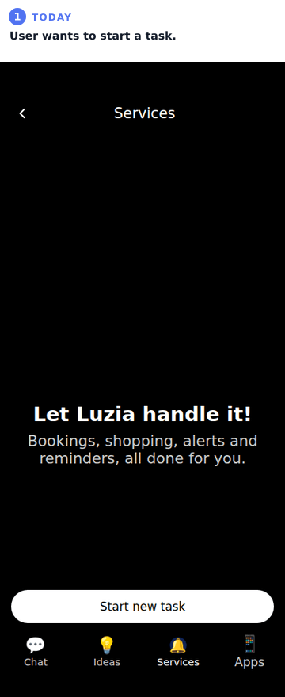
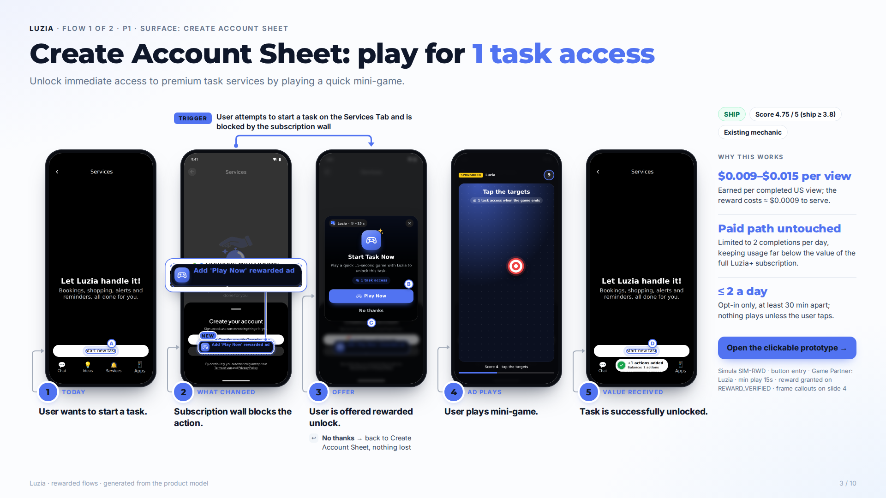
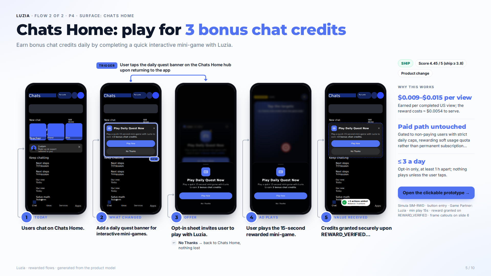

# Results

One section per app, all produced by the same pipeline with no per-app code. This page is generated by `npm run report` (the full interactive report is `out/index.html`; clone the repo and open it, since the mock and the QA report are HTML).

| App | State | Explored | Regime | Verdicts | QA fidelity · flows |
|---|---|---|---|---|---|
| [AOL](#aol) | complete | 17 screens · 58 transitions | no-scarcity | 0 SHIP · 0 REVISE · 3 REJECT | 0.77 · 22/22 |
| [Janitor](#janitor) | complete | 16 screens · 60 transitions | subscription-gated | 2 SHIP · 0 REVISE · 1 REJECT | 0.90 · 45/45 |
| [Luzia](#luzia) | complete | 38 screens · 171 transitions | subscription-gated | 2 SHIP · 0 REVISE · 3 REJECT | 0.72 · 134/135 |
| [OOC](#ooc) | blocked | – | – | – | – |

## AOL

AOL mobile app for browsing curated news feeds, reading articles, viewing comments, and managing personal account feeds. Regime: **no-scarcity**. Profile: shallow.

[Numbers](aol/NUMBERS.md) · [Product model digest](aol/model/digest.md) · [Candidates](aol/proposals/candidates.md) · [Judgments (every score, with evidence)](aol/proposals/judgments.md) · [Trajectory](aol/trajectory.md) · [Slides (PDF)](aol/slides/deck.pdf)

Recommendation slide

### Mock fidelity (real app vs. generated mock)

| Screen | Real app | Mock | Score |
|---|---|---|---|
| Home News Feed |  |  | 0.73 (html) |
| Home News Feed |  |  | 0.79 (html) |
| Home News Feed |  |  | 0.65 (html) |
| News Feed Home |  |  | 0.90 (html) |

Composite = 0.35·layout IoU + 0.25·SSIM + 0.20·text + 0.20·color. Flow QA: 22/22 navigation edges replay correctly.

**Human notes:**

- Removed out/aol/model/screens/ext-browser.png before commit: Chrome's first-run sign-in screen (opened as an external visit from AOL) showed the device owner's first name. The account name and email were also replaced with [name]/[email] in AOL's graph, trace, model and mock text.

## Janitor

An AI character roleplay and exploration platform offering custom chat scenarios, community-created bots, and subscription perks. Regime: **subscription-gated**. Profile: shallow.

[Numbers](janitor/NUMBERS.md) · [Product model digest](janitor/model/digest.md) · [Candidates](janitor/proposals/candidates.md) · [Judgments (every score, with evidence)](janitor/proposals/judgments.md) · [Trajectory](janitor/trajectory.md) · [Slides (PDF)](janitor/slides/deck.pdf)

### P3 in motion

_The lead flow played in the generated mock: today → what changed → the offer → the game → the reward confirmed in-app._

### Shipped flows

**P3: Subscription Feature Sampling via Rewarded Ad**

**P2: Daily Character Quest Hub**

Recommendation slide

### Mock fidelity (real app vs. generated mock)

| Screen | Real app | Mock | Score |
|---|---|---|---|
| Build, Share, Explore |  |  | 0.94 (html) |
| @your_handle |  |  | 0.92 (html) |
| More memory for
long chats. |  |  | 0.91 (html) |
| Janitor Plus Paywall |  |  | 0.83 (html) |

Composite = 0.35·layout IoU + 0.25·SSIM + 0.20·text + 0.20·color. Flow QA: 45/45 navigation edges replay correctly.

## Luzia

Luzia is an AI assistant providing chat capabilities, creative content generation, and a catalog of AI mini-apps, with premium features unlocked via signup or subscription. Regime: **subscription-gated**. Profile: deep.

[Numbers](luzia/NUMBERS.md) · [Product model digest](luzia/model/digest.md) · [Candidates](luzia/proposals/candidates.md) · [Judgments (every score, with evidence)](luzia/proposals/judgments.md) · [Judge self-check](luzia/proposals/judge-eval.md) · [Trajectory](luzia/trajectory.md) · [Slides (PDF)](luzia/slides/deck.pdf)

### P1 in motion

_The lead flow played in the generated mock: today → what changed → the offer → the game → the reward confirmed in-app._

### Shipped flows

**P1: Start Task with Rewarded Refill**

**P4: Daily Character Quest & Credits**

Recommendation slide

### Mock fidelity (real app vs. generated mock)

| Screen | Real app | Mock | Score |
|---|---|---|---|
| Chats Home |  |  | 0.80 (html) |
| Ideas Feed |  |  | 0.62 (html) |
| Ideas Feed |  |  | 0.79 (html) |
| Photo Idea Sheet |  |  | 0.57 (html) |
| Services Tab |  |  | 0.86 (html) |
| Apps Catalog |  |  | 0.83 (html) |

Composite = 0.35·layout IoU + 0.25·SSIM + 0.20·text + 0.20·color. Flow QA: 134/135 navigation edges replay correctly.

**Human notes:**

- luzia-eval-judge failed (exit 1): npm error To see a list of scripts, run: npm error   npm run npm error A complete log of this run can be found in: ~/.npm/_logs/2026-09-25T18_47_29_487Z-debug-0.log 
- luzia-slides failed (exit 1): [slides] failure {"where":"stage:slides","error":"fetch failed"} ✘ fetch failed 
- luzia-eval-judge failed (exit 1): npm error To see a list of scripts, run: npm error   npm run npm error A complete log of this run can be found in: ~/.npm/_logs/2026-09-25T18_47_29_487Z-debug-0.log
- luzia-slides failed (exit 1): [slides] failure {"where":"stage:slides","error":"fetch failed"} ✘ fetch failed
- Resolved: the eval-judge failure above was a script-name typo in the unattended run script (the command is `npm run eval:judge`); it was re-run and wrote proposals/judge-eval.md.
- Resolved: slides failed because the Mac slept mid-call (fetch failed). propose, judge and slides were then re-run with live Gemini from the committed model (proposals had fallen back to stubs during the Mac run because of Gemini 503s).

## OOC

**blocked.** OOC closes itself ~0.8 s after launch on the Google Play emulator (AppSecurity Kill Process D11001); recorded as blocked, not bypassed
- OOC closes itself ~0.8 s after launch on the Google Play emulator (AppSecurity Kill Process D11001); recorded as blocked, not bypassed
